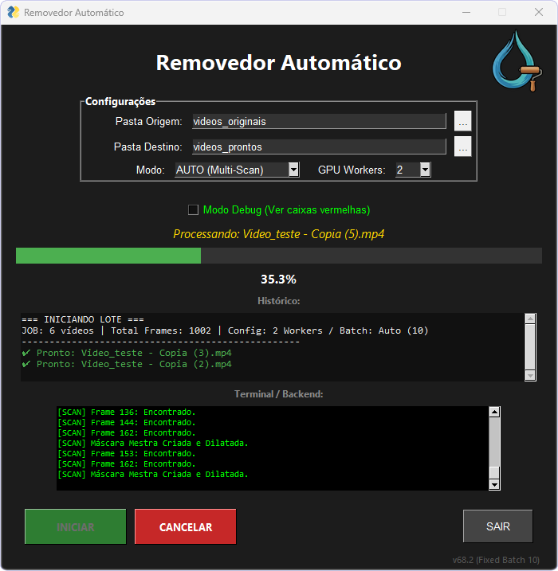

-orange.svg)

> ⚖️ **Aviso de Uso Ético e Legal:**
> Este software é uma ferramenta de **restauração e processamento de vídeo**. Seu objetivo é remover sobreposições indesejadas (como timestamps, logos de gravação ou legendas fixas) de vídeos de autoria própria ou domínio público.
>
> * **Direitos Autorais:** Não utilize esta ferramenta para remover marcas d'água de conteúdos protegidos por terceiros ou para fins de pirataria.
> * **Responsabilidade:** O desenvolvedor não se responsabiliza pelo uso indevido da ferramenta. O usuário final é o único responsável legal pelo conteúdo processado.
> * **Escopo:** O processamento é 100% local (offline), garantindo a privacidade dos seus vídeos.

# 🎥 Removedor Automático de Marcas d'água com IA (Local)

Um software de pós-produção avançado que utiliza visão computacional (**Florence-2**) para detectar onde está a marca d'água e inpainting generativo (**LaMA**) para reconstruir o fundo do vídeo frame a frame, sem necessidade de edição manual.

  <table>
    <tr>
      <td align="center" width="50%">
        
         
        <em>Interface em funcionamento</em>
      </td>
      <td align="center" width="50%">
        
         
        <em>Resultado Antes vs. Depois</em>
      </td>
    </tr>
  </table>

## 💡 Sobre o Projeto

Este projeto resolve a dificuldade de remover elementos estáticos de vídeos sem deixar "borrões" grosseiros. Diferente de softwares tradicionais que apenas desfocam a área, este sistema "entende" o que está atrás da marca d'água e redesenha o conteúdo.

> 🚧 **Limitações Conhecidas (Versão v68.2):**
>
> O algoritmo de detecção inteligente possui as seguintes características:
> 1. **Opacidade:** O sistema é otimizado para remover marcas d'água **sólidas e nítidas**. Marcas muito transparentes ou "fantasmas" podem não ser detectadas corretamente.
> 2. **Posicionamento:** O modo automático varre toda a **periferia do vídeo** (bordas superior, inferior e laterais). Marcas d'água localizadas exatamente no **centro absoluto da tela** serão ignoradas para evitar falsos positivos no conteúdo principal.

### O Fluxo de Trabalho (Pipeline)

1. **Detecção Inteligente:** O modelo **Microsoft Florence-2** analisa o vídeo em múltiplos pontos (Multi-Scan) para encontrar textos ou regiões que pareçam marcas d'água.
2. **Estabilização de Máscara:** Um algoritmo estatístico processa as detecções para garantir que a área de remoção não fique "tremendo" ou mudando de tamanho durante o vídeo.
3. **Inpainting Generativo:** O modelo **LaMA (Large Mask Inpainting)** preenche a área removida baseando-se no contexto visual ao redor, mantendo a continuidade de linhas e texturas.
4. **Reconstrução:** O **FFmpeg** compila os frames processados de volta em um arquivo de vídeo com o áudio original.

  

## 🛠️ Tecnologias e Bibliotecas

* **Microsoft Florence-2:** Modelo de visão-linguagem (VLM) utilizado para detectar automaticamente a localização das marcas d'água sem intervenção humana.
* **LaMA (Resolution-robust Large Mask Inpainting):** Modelo SOTA (State-of-the-Art) para preenchimento de imagens, capaz de lidar com resoluções altas e máscaras grandes.
* **FreeSimpleGUI:** Interface gráfica moderna e amigável para facilitar a configuração de pastas e parâmetros.
* **PyTorch (CUDA):** Backend de processamento acelerado por GPU para garantir performance aceitável em vídeos.
* **FFmpeg:** Manipulação robusta de codecs de vídeo e áudio.

## 🚀 Instalação e Uso

### 1. Pré-requisitos
* **Sistema:** Windows 10 ou 11 (64-bits).
* **Hardware:** Placa de vídeo **NVIDIA** (Recomendado GTX 1060 ou superior).
* **Python:** Versão **3.10** ou **3.11** instalada.
  * *⚠️ Importante:* Na instalação do Python, marque a opção **"Add Python to PATH"**.

### 2. Instalação Automática (`iniciar.bat`) ⚡
Não é necessário abrir terminal ou digitar comandos.
1.  Baixe este repositório e extraia a pasta.
2.  Execute o arquivo **`iniciar.bat`**.
3.  **Na primeira execução:** O script baixará automaticamente todas as dependências (PyTorch, Modelos de IA, Bibliotecas).
    * *Tamanho do Download:* Aprox. **3 GB**.
    * *Espaço em Disco Final:* Aprox. **5 GB**.
4.  **Nas próximas execuções:** O programa abrirá instantaneamente.

### 3. Configuração do FFmpeg 🎞️
O programa exige o **FFmpeg** para funcionar.
* Se você não tiver o FFmpeg, o próprio programa abrirá um **Assistente de Instalação** na primeira vez, guiando você para baixar e colocar o arquivo `ffmpeg.exe` na pasta correta com um clique.

### 4. Como Usar
1.  **Origem:** Selecione a pasta onde estão os vídeos originais.
2.  **Destino:** Selecione onde quer salvar os vídeos limpos.
3.  **Modo:** Mantenha em **`AUTO (Multi-Scan)`** para que a IA analise vários pontos do vídeo e crie uma máscara precisa.
4.  **GPU Workers:** Defina quantos vídeos processar simultaneamente:
    * Use `1` se tiver uma placa de vídeo com menos de 8GB de VRAM (Mais estável).
    * Use `2` se tiver uma placa potente (RTX 3060/4060 ou superior) para dobrar a velocidade.
5.  Clique em **INICIAR**.

## 📊 Performance Estimada

O tempo de processamento depende da resolução do vídeo e da sua placa de vídeo.

| Resolução | GPU (Ex: RTX 3060) | FPS de Processamento |
| :--- | :--- | :--- |
| 1080p | Rápido | ~5 - 8 fps |
| 720p | Muito Rápido | ~10 - 15 fps |
| 4K | Lento | ~1 - 2 fps |

---
**Desenvolvido por Arthur Ravaneli**